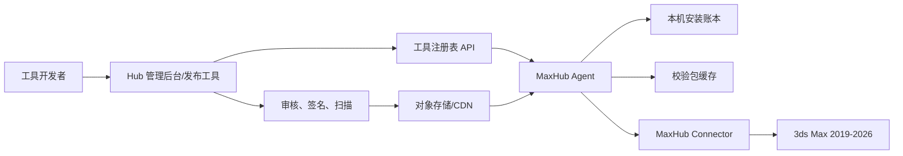

# 3ds Max 插件管理与下载平台方案

## 1. 目标与定位

建设一个面向公司内部 3ds Max 用户的独立插件、脚本与工具分发平台。本项目与 TAPython Installer、Tool Hub 在代码、数据、部署和发布流程上相互隔离、互不影响，但可复用其已验证的设计经验或独立通用能力，包括工具索引、版本化制品、包完整性校验、安装账本、备份回滚与发布审核。

平台由三部分组成：

- **Hub 服务端**：管理工具、版本、审核、下载、权限与审计。
- **MaxHub Agent**：安装在 Windows 本机，负责飞书扫码登录、下载、校验、文件事务、备份、回滚、Connector 安装和日志。
- **MaxHub Connector**：安装在 3ds Max 2019 至 2026 中的连接插件，负责 Max 内的工具浏览、状态展示与生命周期集成。

核心边界：**服务端决定发布什么，Agent 决定身份、Connector 匹配与如何安全落盘，Connector 决定如何在当前 Max 中注册和加载。**



## 2. 关键架构决策

### 2.1 不让 Max 插件承担包管理职责

Connector 不直接保存长期令牌、不直接下载和解压任意包，也不直接执行覆盖式更新。所有高风险文件操作由 Agent 完成，并经由受限的本地接口调用。

原因：

- 3ds Max 正在运行时，已加载 DLL、脚本和启动目录可能无法可靠替换。
- 多个 Max 年份共存时，目录、SDK 与原生插件 ABI 可能不同。
- 下载、签名校验、备份、恢复和安装日志需要独立于 Max 进程持续可用。

### 2.2 独立建设 MaxHub，按需复用通用能力

MaxHub 是独立项目，拥有独立代码仓库、服务端、数据存储、部署配置、发布流程和运维监控。它不读写 TAPython/Tool Hub 的业务数据，也不依赖其运行状态；任一平台升级、故障或下线均不得影响另一平台。

已有能力以设计经验、协议规范或可独立版本化的通用组件形式复用，并在 MaxHub 内独立集成和验收，不通过共享数据库、内部接口或发布链路形成运行时耦合。

可复用能力：

- 工具索引、详情、分类、搜索与版本频道。
- 包上传、对象存储、哈希校验与下载。
- 发布审核、下架、撤回和变更审计。
- 组织、角色与工具可见范围的设计模式。

MaxHub 独立负责：3ds Max 工具元数据、用户与权限映射、安装和行为统计、审核记录、安装目录映射、脚本注册方式、重启要求、Max 版本兼容性及原生插件规则。

### 2.3 首期只支持脚本型工具

MVP 支持 MaxScript、Python、MacroScript 和静态资源。原生 `.dlu`、`.dlm`、`.dll`、C++/C# 插件放入第二阶段。

这样可以先验证分发、安装、更新、卸载与回滚闭环，避免原生插件的 ABI 兼容、管理员权限、依赖 DLL 和文件锁定问题影响平台首发。

## 3. 用户与场景

| 角色 | 核心任务 |
| --- | --- |
| 美术用户 | 在 Max 中发现、安装、更新、启用、禁用或回滚工具。 |
| 技术美术/开发者 | 打包、上传、声明兼容性、提交审核、维护版本与发布说明。 |
| 审核者 | 检查包内容、权限、依赖、兼容性与风险后发布或退回。 |
| 管理员 | 管理组织权限、工具可见性、发布频道、强制版本和故障诊断。 |

典型流程：

1. 开发者上传一个带清单的工具包。
2. 服务端校验清单、文件规则、哈希与签名，审核者发布到 `internal`、`beta` 或 `stable`。
3. 用户在 Agent 中通过飞书扫码登录，服务端将企业员工身份映射为 MaxHub 用户。
4. Agent 自动识别本机安装的 Max 2019 至 2026，并从 Connector 管理入口安装匹配版本的 Connector。
5. Agent 同步当前用户有权限的索引，用户在 Max 内的 Connector 选择工具并确认安装计划。
6. Agent 下载、校验、备份、写入暂存区并在安全时机激活。
7. Connector 注册 MacroScript 或加载脚本；需重启的更新明确提示。
8. 发生加载问题时，从本地账本恢复上一个可用版本，并上报脱敏诊断日志。

## 4. 客户端设计

### 4.1 MaxHub Agent

建议采用 .NET 8 Windows 桌面程序，初期以常驻托盘程序加本地 HTTP/Named Pipe 服务实现，不建议一开始即做 Windows Service。

职责：

- 通过飞书企业自建应用提供扫码登录；由服务端完成授权码交换和员工身份映射，Agent 不接触飞书密码。
- 获取企业员工唯一标识与用户名；所有 Agent 请求携带 MaxHub 会话，由服务端从会话推导用户身份，并将 Agent 侧浏览、下载、安装、回滚及管理端上传事件关联到同一 MaxHub 用户。
- 刷新 MaxHub 会话令牌，并使用 Windows DPAPI 保护本地凭据。
- 拉取增量索引、下载包、缓存和断点续传。
- SHA-256、签名与文件清单校验。
- 生成安装计划，执行暂存、备份、原子切换、卸载与回滚。
- 维护每台机器、每个 Max 用户配置目录的安装账本。
- 通过 Autodesk 安装信息、注册表和可执行文件路径交叉识别本机 Max 2019 至 2026，避免仅凭目录名称判断版本。
- 从独立的 Connector 版本索引下载已签名制品，按 Max 版本或经验证的兼容分组执行安装、更新、修复与卸载。
- 提供本地诊断、日志导出和连接状态。

本地目录建议：

```text
%LOCALAPPDATA%\MaxHub\
├─ cache\             # 已校验的下载包
├─ connectors\        # 已校验的 Connector 制品与版本元数据
├─ staging\           # 待激活的安装内容
├─ backups\           # 按工具和版本保存的恢复点
├─ logs\
├─ installed.json      # 受 Agent 管理的安装账本
└─ agent-settings.json
```

安全要求：

- 本地接口仅监听 `127.0.0.1` 或命名管道，并校验当前 Windows 用户。
- 飞书授权码和访问令牌只在授权链路中短期使用；Agent 仅持有 MaxHub 会话凭据，不落盘保存飞书密码或长期访问令牌。
- 统计事件采用最小必要字段，明确区分审计与分析用途，并设置访问权限、保留期限和脱敏规则。
- 客户端不得提交或覆盖统计事件中的用户 ID；上传和下载由服务端业务接口记账，安装状态由安装事件接口记账，浏览类事件使用唯一事件 ID 保证幂等。
- 包不得携带任意绝对写入路径；目标目录只允许从逻辑目标白名单解析。
- 卸载只依据安装账本与已记录文件哈希执行，禁止按名称猜测目录后递归删除。
- 所有覆盖动作先备份；失败时自动恢复到前一完整状态。

Agent 首期界面：

| 页面 | 内容 |
| --- | --- |
| 账号 | 飞书扫码登录、员工用户名、会话状态与退出登录。 |
| Connector 管理 | 展示检测到的 Max 版本、安装路径、Connector 兼容版本及安装/更新/修复/卸载操作；首次可对全部兼容版本批量安装。 |
| 下载与任务 | Connector 和工具包下载进度、校验结果、失败重试与历史任务。 |
| 诊断 | Agent 连接、缓存、安装账本、日志与诊断包导出。 |

### 4.2 MaxHub Connector

Connector 采用 MaxScript 脚本实现：停靠面板用 rollout 构建，网络与 JSON 能力通过 dotNet 桥使用随 Max 自带的 .NET Framework 类库。不依赖 3ds Max SDK，无需按年份编译，一套脚本覆盖 Max 2019 至 2026，只需真机回归验证。Connector 是薄客户端，不存储核心安装逻辑。

Connector 的统一下载安装入口位于 Agent 的“Connector 管理”页面。Agent 识别本机 Max 版本后，只展示并安装与目标 Max 匹配且签名有效的 Connector 制品；多版本共存时分别维护安装状态，不要求用户手工查找安装包。Connector 不自行下载或覆盖更新自身。

Connector 是 MaxHub 自有平台组件，不属于工具包原生插件支持范围。它使用独立、固定的安装目标白名单和安装账本，不允许工具包 manifest 引用；目标 Max 正在运行时不得覆盖已加载的 Connector，更新只能安排在 Max 关闭后或下次启动前完成，并保留上一版本用于回滚。

Max 内功能：

- 停靠面板：发现、已安装、更新、环境、诊断。
- 获取当前 Max 年份、用户脚本目录和加载状态。
- 调用 Agent 查询安装计划、执行安装和回滚。
- 在合适时机执行脚本注册或延迟加载。
- 明确展示“立即生效”或“重启 3ds Max 后生效”。

首期 UI 页面：

| 页面 | 内容 |
| --- | --- |
| 发现 | 搜索、分类、标签、描述、兼容性、风险等级与安装按钮。 |
| 已安装 | 已装版本、更新、启用/禁用、修复、卸载和回滚。 |
| 更新 | 当前 Max 版本可更新项、批量更新与重启提示。 |
| 环境 | Agent 连接、Max 版本、脚本目录、缓存与账号状态。 |
| 诊断 | 安装日志、加载失败信息和诊断包导出。 |

## 5. 包协议

MaxHub 复用宿主无关的版本化包设计，例如 `.dccc-tool.zip`。当前项目只接受 `hostType: "3dsmax"`，保留该字段是为了清单自描述和协议校验，不代表 MaxHub 承担多宿主分发，也不与 TAPython/Tool Hub 共享后端。包内以 `manifest.json` 作为唯一安装声明来源。

```text
scene-batch-renamer-1.4.0.dccc-tool.zip
├─ manifest.json
├─ payload/
│  └─ 3dsmax/
│     ├─ scripts/
│     ├─ macros/
│     ├─ startup/
│     ├─ plugins/
│     └─ assets/
├─ uninstall/
│  └─ cleanup.json
├─ docs/
└─ signatures/
   └─ package.sig
```

示例清单：

```json
{
  "schemaVersion": 1,
  "id": "com.company.scene-batch-renamer",
  "name": "Scene Batch Renamer",
  "version": "1.4.0",
  "hostType": "3dsmax",
  "compatibility": {
    "minVersion": 2019,
    "maxVersion": 2026,
    "platforms": ["win-x64"]
  },
  "install": {
    "scope": "user",
    "restartRequired": false,
    "targets": [
      {
        "source": "payload/3dsmax/scripts",
        "destination": "userScripts"
      },
      {
        "source": "payload/3dsmax/macros",
        "destination": "userMacros"
      }
    ]
  },
  "entryPoints": [
    {
      "kind": "macroScript",
      "script": "macros/SceneBatchRenamer.mcr",
      "category": "Company Tools"
    }
  ],
  "dependencies": [
    {
      "id": "com.company.max-common-lib",
      "range": "^2.0.0"
    }
  ],
  "permissions": ["file.read", "file.write"],
  "integrity": {
    "sha256": "<package-sha256>"
  }
}
```

逻辑目标白名单：

| 逻辑目标 | 解析位置 | MVP |
| --- | --- | --- |
| `userScripts` | 当前用户当前 Max 版本的 Scripts 目录 | 支持 |
| `userMacros` | 当前用户 MacroScripts 目录 | 支持 |
| `userStartup` | 当前用户 Startup Scripts 目录 | 支持，需风险提示 |
| `userPlugins` | 当前用户插件目录 | 第二阶段 |
| `projectScripts` | 由项目上下文指定的目录 | 第二阶段 |
| `sharedScripts` | 公司公共目录 | 第二阶段，仅管理员授权 |

以上逻辑目标只适用于工具包。Connector 使用 Agent 内置的专用目标映射，不通过 `userPlugins` 或工具包 manifest 安装。

## 6. 服务端设计

### 6.1 核心领域模型

| 实体 | 主要字段 |
| --- | --- |
| `Tool` | 稳定 ID、名称、简介、分类、维护人、可见范围、状态。 |
| `ToolRelease` | 工具 ID、版本、频道、兼容性、发布说明、审核状态、发布日期。 |
| `PackageArtifact` | 存储路径、大小、SHA-256、签名、扫描状态。 |
| `Dependency` | 发布版本、依赖工具 ID、语义化版本范围。 |
| `Channel` | `internal`、`beta`、`stable`、`deprecated`。 |
| `EnterpriseUser` | MaxHub 用户 ID、飞书员工身份映射、用户名、账号状态和最后登录时间。 |
| `ConnectorRelease` | Connector 版本、支持的 Max 版本或 ABI 分组、制品、签名和发布状态。 |
| `Installation` | 用户、设备、Max 版本、工具、当前版本、状态、最后同步时间。 |
| `ActivityEvent` | 唯一事件 ID、服务端推导的用户、事件类型、来源、工具或 Connector、客户端版本、时间与最小必要上下文。 |
| `Policy` | 组织级允许/禁止列表、最低版本、强制更新、缓存策略。 |
| `AuditLog` | 上传、审核、发布、安装、回滚、撤回与权限变更记录。 |

### 6.2 API 草案

MaxHub 使用独立 API、身份域和数据存储。接口设计可借鉴已有平台的缓存、制品校验和审核模式，但不调用其内部 API，也不共享业务数据库。

| 方法 | 路径 | 用途 |
| --- | --- | --- |
| `GET` | `/api/v1/tools?maxVersion=2026` | 返回用户可见的 3ds Max 兼容工具索引。 |
| `GET` | `/api/v1/tools/{toolId}` | 返回工具详情、可用版本、权限和依赖。 |
| `GET` | `/api/v1/tools/{toolId}/releases/{version}/install-plan` | 返回 Agent 可执行的安装计划模板。 |
| `POST` | `/api/v1/auth/feishu/qr-sessions` | 创建飞书扫码登录会话并返回受控授权入口。 |
| `GET` | `/api/v1/auth/feishu/qr-sessions/{sessionId}` | 查询扫码状态；授权完成后由服务端交换凭据并签发 MaxHub 会话。 |
| `POST` | `/api/v1/auth/sessions/refresh` | 使用受保护的刷新凭据续期 MaxHub 会话。 |
| `DELETE` | `/api/v1/auth/sessions/current` | 退出并撤销当前 MaxHub 会话。 |
| `GET` | `/api/v1/connectors?maxVersion={year}` | 返回指定 Max 年份可安装的 Connector 版本与签名制品。 |
| `POST` | `/api/v1/activity/events` | 幂等上报搜索、列表和详情浏览等非安装类客户端统计事件。 |
| `POST` | `/api/v1/installations/events` | 上报安装、更新、回滚和失败事件。 |
| `POST` | `/api/v1/publish/releases` | 上传或创建待审核发布版本。 |
| `POST` | `/api/v1/releases/{releaseId}/review` | 审核通过、退回或撤回。 |
| `GET` | `/downloads/{toolId}/{version}/package.zip` | 返回带权限校验的下载地址或重定向。 |
| `GET` | `/downloads/connectors/{maxVersion}/{connectorVersion}/package.zip` | 返回对应 Max 版本的签名 Connector 制品。 |

API 返回的下载制品必须带版本、大小、SHA-256、签名标识和过期时间。Agent 校验通过后才能进入安装阶段。上传与下载由对应服务端业务接口按认证主体直接记账；客户端事件中的用户身份不作为可信输入。

### 6.3 权限与发布治理

- 登录身份：MaxHub Agent 使用飞书扫码登录，服务端以飞书员工身份映射 MaxHub 用户，管理后台使用同一身份域；上传、浏览、下载和安装事件由各自唯一数据源记账，并统一关联服务端解析的 MaxHub 用户 ID，展示时使用企业员工用户名。
- 角色：`viewer`、`publisher`、`reviewer`、`organization-admin`、`platform-admin`。
- 发布频道：开发者默认只可提交 `internal`；`beta`、`stable` 需要审核。
- 风险分级：脚本写入用户目录为低风险；启动脚本为中风险；原生插件、网络访问和机器级安装为高风险。
- 紧急撤回：服务端将版本标记为撤回，Agent 阻止新安装，并对已安装用户给出回滚通知。
- 许可证和依赖：每个包必须声明来源、第三方依赖和许可证；无法识别的二进制文件拒绝进入稳定频道。
- 统计治理：审计日志与产品分析数据分开授权，默认不采集工具脚本内容、用户文件路径和场景数据；统计字段、用途及保留期限需在上线前确认。

## 7. 安装、更新与回滚

### 7.1 Connector 安装

1. 用户在 Agent 中完成飞书扫码登录。
2. Agent 扫描并校验本机 Max 2019 至 2026 的安装信息，列出版本、路径和当前 Connector 状态。
3. Agent 查询独立 Connector 版本索引，为每个 Max 安装实例选择精确年份或兼容分组的制品。
4. 用户确认安装计划后，Agent 下载并校验制品哈希、签名和目标版本。
5. Agent 安装到经验证的对应 Max 插件目录并记录账本；多版本安装互不覆盖。
6. 安装失败时恢复原 Connector，记录诊断信息且不得影响其他 Max 版本。

### 7.2 工具安装事务

1. Connector 向 Agent 请求指定工具和版本的安装计划。
2. Agent 解析本机 Max 环境、兼容性和依赖，返回将写入的目录与文件清单。
3. 用户确认后，Agent 下载包并验证哈希、签名和包内清单。
4. Agent 将现有受管理文件备份到 `backups`，再把新文件解压至 `staging`。
5. 文件全部校验成功后，按计划切换到正式目录并写入 `installed.json`。
6. Connector 注册 MacroScript 或标记下次启动时加载。
7. Agent 上报结果；任何失败都停止后续操作并恢复备份。

### 7.3 更新策略

- 脚本文件：可在 Max 空闲时更新；若工具已加载，默认提示重新打开工具或重启 Max。
- Startup/MacroScript：更新后要求重新启动 Max 或明确执行重载。
- 原生插件：第二阶段统一采用“下次启动激活”，禁止运行时强制覆盖。
- 依赖更新：先计算完整依赖图，确认所有兼容版本后再写入文件。
- 批量更新：按风险和重启要求分组展示，用户可单独跳过高风险项。

### 7.4 本机安装账本

每个已管理工具和 Connector 必须保存：制品 ID、版本、目标 Max 版本、安装范围、目标目录、文件相对路径、文件哈希、安装时间、备份版本和激活状态。

账本是卸载、修复与回滚的唯一依据。与 TAPython Installer 当前的工具安装账本一样，未被平台记录的用户文件必须保留。

## 8. MVP 范围与验收标准

### 8.1 MVP 包含

- MaxHub 作为独立项目建设，不依赖 TAPython/Tool Hub 的服务、数据或发布流程。
- 支持 3ds Max 2019 至 2026 的脚本型工具分发和 Connector 安装。
- 支持 MaxScript、Python、MacroScript、用户 Scripts/Macros/Startup 目录。
- Hub 中的工具浏览、搜索、版本选择、`internal`/`beta`/`stable` 频道。
- 飞书扫码登录、企业员工用户名映射、权限过滤及上传/浏览/下载/安装事件关联。
- Agent 自动识别本机 Max 版本，并提供对应 Connector 的安装、更新、修复与卸载入口。
- SHA-256 校验、包签名和安装账本。
- 安装、更新、修复、卸载、单版本回滚和本地诊断日志。
- Max 内停靠面板和独立 Agent 诊断入口。
- 管理端的上传、清单校验、审核、发布、下架与撤回。

### 8.2 MVP 不包含

- 第三方原生 `.dlu/.dlm/.dll` 工具插件自动更新；MaxHub 自有 Connector 是平台组件例外，按专用安全流程安装和更新。
- 项目级工具集和共享网络目录安装。
- 企业强制版本、灰度发布和使用分析看板。
- 跨项目依赖、与 TAPython/Tool Hub 的账号或制品同步及复杂的离线授权。

### 8.3 验收标准

- 发布或升级 MaxHub 时不修改 TAPython/Tool Hub 的代码、数据和部署，任一平台不可用不影响另一平台运行。
- 同一机器安装 2019、2022、2024、2026 时，Agent 能准确识别各实例，并为每个实例安装匹配的 Connector，不跨版本覆盖。
- Connector 在 Max 2019 至 2026 各支持版本中均能启动，并只展示当前版本兼容的工具。
- 用户可通过飞书扫码完成登录；服务端能将员工用户名正确关联到上传、浏览、下载和安装事件，且未授权用户不可访问统计明细。
- 安装前可明确看到目标 Max 目录、文件数量、重启要求和风险等级。
- 下载包的哈希或签名不匹配时，绝不写入 Max 目录。
- 安装中断或文件写入失败后，已有工具仍可恢复到可用版本。
- 卸载不会删除未被账本记录的用户文件。
- Agent 不运行时，Connector 能清楚展示离线状态且不会假报安装成功。

## 9. 分阶段实施计划

### 阶段 0：规格与验证，2-3 周

- 冻结 Max 2019 至 2026 的安装识别规则、Connector 构建矩阵、目录映射和脚本类型。
- 确认飞书企业自建应用、扫码授权流程、员工身份映射字段、统计事件范围与数据保留规则。
- 选取 3 至 5 个真实 MaxScript/Python/MacroScript 工具制作样本包。
- 冻结 `manifest.schema.json`、安装账本格式和风险分级规则。

交付：协议草案、样本包、兼容性矩阵、安装测试用例。

### 阶段 1：独立 MaxHub 服务端，4-6 周

- 建立独立代码仓库、数据库、对象存储命名空间、部署流水线和监控告警。
- 实现 3ds Max 工具、版本、Connector 制品、兼容性和索引模型。
- 接入飞书扫码登录服务端流程、MaxHub 用户映射及最小统计事件模型。
- 实现 Max 工具详情、下载制品、审核状态和最小发布页面。
- 在服务端执行 manifest 与包内文件规则校验。

交付：可发布并检索 `3dsmax` 工具版本的 Hub API 与管理后台。

### 阶段 2：MaxHub Agent，4-5 周

- 完成飞书扫码登录、员工用户名展示、索引同步、缓存、下载、校验、安装计划、账本、备份和回滚。
- 实现 Max 2019 至 2026 自动识别及 Connector 管理入口，支持匹配制品的安装、更新、修复和卸载。
- 实现命令行或最小 WPF 诊断界面，先验证安装引擎。
- 建立包损坏、网络中断、文件占用、目录不可写等失败恢复测试。

交付：可脱离 Max 执行脚本包安装、卸载和回滚的 Agent。

### 阶段 3：MaxHub Connector，3-4 周

- 用 MaxScript 实现跨 Max 2019 至 2026 的 Connector 脚本，由 Agent 统一安装，无需 SDK 与按年份编译。
- 完成停靠面板、Agent 通信、安装状态展示和 MacroScript 注册。
- 在 Max 2019 至 2026 各版本上进行加载、通信与脚本注册兼容性回归（重点验证 2019 与 2026 的 MaxScript/dotNet 桥差异）。

交付：可在 Max 内发现、安装、更新和管理脚本工具的 MVP。

### 阶段 4：发布治理与扩展，持续迭代

- 完善飞书组织信息同步、审核流、日志聚合、撤回通知和组织策略。
- 引入原生插件安装模式、延迟激活、管理员授权和 ABI 兼容规则。
- 增加项目级工具集、灰度发布、强制更新和使用情况分析。

## 10. 主要风险与应对

| 风险 | 应对策略 |
| --- | --- |
| 独立项目重复建设通用能力 | 只抽取边界清晰、可独立版本化的协议或组件；MaxHub 保持独立数据和部署，并为复用能力建立自己的验收测试。 |
| Max 多版本目录和 SDK 差异 | Connector 用 MaxScript 实现，天然跨版本运行；工具兼容性由 manifest 强制声明；建立真实版本回归矩阵。 |
| 本机 Max 识别错误或残留安装 | 注册表、Autodesk 安装信息与可执行文件路径交叉校验；安装前展示版本和路径，允许用户排除误识别实例。 |
| 飞书登录服务暂时不可用 | 已登录用户在令牌有效期内保持受限可用；新登录和需重新授权的操作明确失败，不降级为匿名身份。 |
| 员工行为统计带来隐私与权限风险 | 最小化采集，区分审计和分析用途，限制统计明细访问并设置保留期限，不采集场景内容与用户文件信息。 |
| 原生插件文件被锁定 | MVP 不支持第三方原生工具插件；MaxHub Connector 仅在目标 Max 关闭后或下次启动前更新，并保留完整备份与回滚。 |
| 恶意或误操作脚本 | 包签名、审核、风险分级、权限声明、白名单安装目标和审计。 |
| 卸载误删用户文件 | 仅根据账本记录的相对路径和哈希处理；冲突时保留文件并提示人工处理。 |
| Agent/Connector 版本不匹配 | 本地协议版本协商、最低 Agent 版本字段与独立自更新机制。 |
| 内网不可用 | 使用已验证包缓存和上次同步索引；明确离线能力边界，不离线安装未知版本。 |

## 11. 下一步决策清单

启动实现前，需要确认以下事项：

1. Max 2019 至 2026 是否全部只覆盖 x64 Windows，以及各版本可用于真实回归的测试环境。
2. 首期是否只管理用户级 Scripts/Macros/Startup，还是要包含工作室共享目录。
3. 飞书企业自建应用的负责人、授权范围、回调域名，以及用户名之外是否允许同步员工编号或部门。
4. 上传、浏览、下载、安装等统计事件的字段、用途、可见角色和保留期限。
5. Connector 脚本在 Max 2019 与 2026 上的 MaxScript/dotNet 桥差异验证环境，以及每个 Max 版本的用户级安装目录与检测依据。
6. TAPython/Tool Hub 中哪些能力可作为独立组件或协议复用，并明确禁止共享的业务数据、内部接口和发布链路。
7. 第一个试点团队与 3 至 5 个真实工具样本，作为安装、升级、冲突和回滚的验收样本。

建议先完成阶段 0 的协议和真实样本验证，再建立 Agent。Agent 是整个方案的文件事务核心；没有它，Connector 很容易演变成难以维护、难以回滚的脚本下载器。