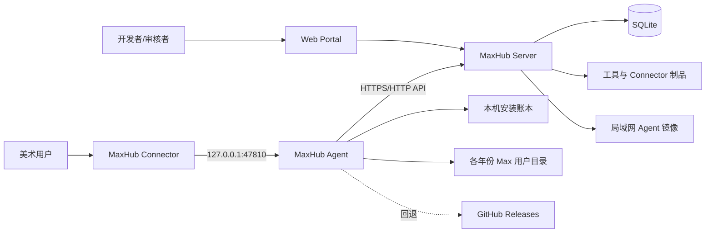

# MaxHub 开发文档

> 本文记录 MaxHub 从立项、方案冻结、分阶段实现到当前生产版本的完整开发过程，并作为后续开发、维护与交接的事实基线。
>
> - 项目周期：2026-08-18 至今
> - 文档更新：2026-08-21
> - 当前 Agent：1.0.22
> - 当前 Connector：1.5.7
> - 生产地址：http://10.2.13.8:5100
> - 代码仓库：https://github.com/BOOHHP/maxhub

## 1. 项目背景

MaxHub 是面向公司内部 3ds Max 美术与技术美术团队的脚本、工具分发管理平台。项目最初要解决的问题是：3ds Max 脚本主要依靠人工复制、群文件或共享目录传播，缺少统一入口、版本管理、兼容性约束、审核、签名校验、卸载回滚和使用统计。

项目从一开始就确定为独立系统：

- 与 TAPython Installer、Tool Hub 在代码、数据、部署和发布流程上相互隔离。
- 可以复用经过验证的设计经验，但不共享业务数据库或运行时依赖。
- 支持同一台 Windows 机器并存的 3ds Max 2019–2026。
- 首期优先解决 MaxScript、Python、MacroScript 等脚本型工具，暂不自动管理第三方原生 `.dlu/.dlm/.dll` 插件。

平台最终形成三个运行单元：

1. **MaxHub Server**：工具索引、发布审核、权限、签名、下载、统计和 Web Portal。
2. **MaxHub Agent**：飞书登录、Max 检测、包校验、安装账本、Connector 管理、自更新和本地服务。
3. **MaxHub Connector**：运行在 3ds Max 内的 MaxScript 工具中心，负责浏览、安装、运行、更新和诊断入口。

## 2. 核心目标与边界

### 2.1 核心目标

- 自动识别本机 3ds Max 2019–2026 安装。
- 为每个 Max 版本安装独立、匹配的 Connector。
- 在 Max 内统一浏览、安装、更新、运行、卸载和回滚工具。
- 使用飞书扫码完成企业身份认证。
- 支持开发者上传、审核者审核、管理员治理的发布流程。
- 对制品执行 SHA-256 与 ECDSA P-256 签名校验。
- 使用账本约束所有写入、卸载和回滚操作。
- 提供 Agent 自更新、局域网镜像和 GitHub 回退链路。

### 2.2 责任边界

- **Server 决定发布什么**：版本、频道、兼容范围、角色权限和签名元数据由服务端管理。
- **Agent 决定如何安全落盘**：身份、下载、验签、备份、安装、卸载、回滚和自更新由 Agent 负责。
- **Connector 决定如何融入当前 Max**：当前年份、工具展示、脚本执行和交互状态由 Connector 负责。

Connector 始终保持薄客户端：不保存长期令牌、不直接下载任意包、不解压制品、不进行覆盖式文件更新。

## 3. 当前总体架构



### 3.1 仓库结构

```text
src/
├─ MaxHub.Core/          Manifest、打包、签名、脚本解析、公共模型
├─ MaxHub.Server/        ASP.NET Core API、EF Core SQLite、Web Portal
├─ MaxHub.Agent.Core/    Max 检测、路径解析、安装引擎、HubClient、自更新
├─ MaxHub.Agent.Service/ 本地 HTTP 服务，监听 127.0.0.1:47810
├─ MaxHub.Agent.Cli/     检测、登录、发布、审核、Connector 同步等命令
└─ MaxHub.Agent.Tray/    WPF 托盘客户端
connector/
└─ maxhub_connector.ms   3ds Max 内工具中心
protocol/                Manifest 与安装账本 Schema
tests/                   Core、Agent、Server 三组 xUnit 测试
tools/                   Agent 发布与 Server 部署脚本
samples/tools/           示例工具包
```

### 3.2 技术栈

| 层 | 技术 |
| --- | --- |
| Server | .NET 8、ASP.NET Core Minimal API、EF Core、SQLite |
| Agent | .NET 8、WPF、Hardcodet NotifyIcon、DPAPI |
| Connector | MaxScript rollout、3ds Max 自带 .NET Framework 桥 |
| 安全 | ECDSA P-256、SHA-256、TOFU 公钥固定 |
| 身份 | 飞书 Passport OAuth / QR 登录 |
| 测试 | xUnit、WebApplicationFactory、临时 SQLite |
| 发布 | 自包含单文件 win-x64、GitHub Releases、局域网镜像 |

## 4. 开发过程时间线

项目主体在 2026-08-18 至 2026-08-20 三天内完成首轮闭环，并在真实使用反馈中持续迭代。

## 4.1 2026-08-18：从协议到完整闭环

### 阶段 0：协议和样本冻结

首个提交冻结了 Manifest、安装账本协议、校验器、打包器和三个示例工具，建立了 32 项测试。此阶段先定义“什么是合法工具包”，避免后续 Server、Agent 和 Connector 各自解释协议。

关键产物：

- `protocol/manifest.schema.json`
- `protocol/installed-ledger.schema.json`
- `ManifestValidator`
- `ToolPackage` / `ScriptPackage`
- `samples/tools/` 示例包

### 阶段 1：独立 Server

随后实现独立 ASP.NET Core 服务端：

- 飞书 QR 登录的 Mock Provider，用于先验证流程。
- 发布、审核、索引、下载和 Connector 制品接口。
- 幂等活动事件与安装事件。
- 后续接入真实飞书 Passport 授权码交换，AppSecret 只保留在服务端。

早期 Server 数据以内存为主，完整链路跑通后迁移到 EF Core SQLite，持久化发布、Connector、用户、角色、活动事件和刷新令牌。

### 阶段 2：Agent Core 与 CLI

Agent Core 完成：

- 注册表与 `3dsmax.exe` 交叉校验，识别 Max 2019–2026。
- 本地化用户目录解析，不再写死 `ENU`，而是选择最近写入 `3dsMax.ini` 的语言目录。
- 安装计划、暂存、备份、激活、卸载和单版本回滚。
- `installed.json` 安装账本。
- HubClient 与 CLI 命令。

CLI 先承担端到端验证职责，包含：检测 Max、扫码登录、打包、上传、审核、注册 Connector、同步 Connector、安装、卸载和回滚。

### 阶段 3：Connector 从 SDK 插件改为 MaxScript

早期曾考虑 .NET/Autodesk SDK Connector，但很快改为纯 MaxScript：

- 不依赖 Autodesk SDK。
- 不需要按年份编译 2019–2026 八套二进制。
- rollout 构建 UI，网络调用通过 Max 自带 .NET 桥完成。
- Agent 按年份安装同一脚本制品，保留独立账本。

这是项目中影响最大的架构简化之一，显著降低了兼容矩阵、构建和分发成本。

### 本地服务与 Max 内安装闭环

Agent 增加仅监听 `127.0.0.1:47810` 的本地 HTTP 服务，Connector 通过纯文本协议调用：

- 健康检查。
- 工具列表、已安装列表、更新列表。
- 异步安装任务与进度轮询。
- 卸载、回滚和脚本运行信息。

Connector 安装进度采用异步 Job：POST 创建任务，Connector 每 200ms 轮询状态，避免 Max UI 被长下载阻塞。

### WPF Agent、签名和管理后台

同日后续完成：

- WPF 托盘 Agent，包含账号页与 Connector 管理页。
- 托盘状态图标、开机自启、退出登录确认和安装进度。
- ECDSA P-256 制品签名，Agent 使用 TOFU 固定服务端公钥。
- Web 管理后台：审核队列、版本列表、Connector 上传和统计。
- 用户目录映射、发布撤回和刷新令牌续期。

到 8 月 18 日结束时，扫码登录、发布、审核、下载、验签、安装和 Max 内执行的主链路已经贯通。

## 4.2 2026-08-19：产品化、生产部署与六个功能批次补齐

这里的“六个功能批次”来自开发过程中追加并明确的产品需求，不等同于根方案中的阶段 0–4。根方案阶段用于描述项目生命周期；六个功能批次用于描述角色、Portal、脚本识别、分发、自更新和工具管理六组交付能力。

### Connector 兼容性修复

真实 MaxScript 环境暴露了若干与常规语言不同的问题：

- MaxScript 没有预期的 `tabControl`，改为带选中态的按钮页签。
- rollout 中前向调用的函数需要显式前向声明。
- 丢失的 `httpPost` 会让安装、卸载、回滚全部失效。
- MacroScript 体内未声明名称会被编译为隐式局部变量。
- 第三方启动脚本的未处理异常会中断整个 Startup 队列，因此 Connector loader 使用 `0_` 前缀优先加载。

### Agent 可分发化

Agent 从开发运行方式转为真正可分发产品：

- 发布为 .NET 8 自包含、单文件、win-x64 EXE。
- 增加托盘图标、版本显示和开机自启。
- 默认连接生产 Server，同时允许通过 `MAXHUB_SERVER` 环境变量覆盖。
- 增加自更新：检查版本、下载、SHA-256 校验、退出旧进程、替换并重启。

### 角色与 Web Portal

完成六个功能批次中的第一、二项：

- 自管角色体系：管理员、审核者、发布者。
- 登录时把飞书员工身份映射为 MaxHub 用户。
- 工具市场首页、发布页、后台管理页。
- 管理后台侧边栏、成员角色设置、版本管理、Connector 管理和统计。
- Web 飞书扫码登录及登录态恢复。

### 脚本自动识别

完成六个功能批次中的第三项：

- 解析 `@name`、`@description` 等结构化头部标签。
- 回退读取 rollout 标题、文件名和关键词。
- 自动生成脚本包与 Manifest。
- Web 和 Agent 上传时自动预填名称、描述与兼容范围。

### Agent 自更新和工具管理

完成六个功能批次中的第五、六项；第四项 Agent / Connector 分发已在前一日形成闭环，并在此阶段完成生产化：

- Server 提供 `/api/v1/agent/latest`。
- 后台可登记 Agent 版本，无需重启 Server。
- 自动发现 GitHub 最新 Release，并提供 DB 与配置回退。
- Agent 增加工具管理页：查看/卸载本机工具、市场安装、脚本上传。

### 生产部署

项目部署到公司服务器：

- 生产 URL：`http://10.2.13.8:5100`
- 服务器共享：`\\10.2.13.8\Server\maxhub`
- 服务器本机目录：`D:\Server\maxhub`
- 生产数据：`data/maxhub.db`
- 签名私钥：Server `data/signing/`，不进入 Git

部署脚本 `tools/deploy-server.ps1` 每次先 fresh publish，再覆盖程序文件，同时保留 `data/` 和 `appsettings.Local.json`。这项约束来自一次真实问题：直接复制旧 publish 目录会把新版 Web 静态文件覆盖回旧版本。

## 4.3 2026-08-20：真实使用反馈驱动的稳定化

### Agent 1.0.4–1.0.12：跨 8 月 19–20 日的更新链路与 UI 可用性

该版本段跨越两个自然日：内置发布说明将 1.0.4–1.0.8 归入 8 月 19 日，将后续版本归入 8 月 20 日；Git 提交时间中 1.0.8 位于 8 月 20 日零点附近。此处按“8 月 20 日稳定化工作延续”归档，不把整个版本段视为同日完成。

主要迭代包括：

- 1.0.4 阶段曾采用 GitHub 直连优先、Server 回退；1.0.13 后改为当前的 Server 优先、GitHub 直连回退。
- 签名公钥按服务器 authority 隔离，避免开发/生产 TOFU 冲突。
- 深色 ComboBox、ToolTip 和托盘右键菜单。
- 自更新时主动退出进程，重试等待文件锁释放。
- Max 内已安装列表显示工具名称，不暴露内部 ID。
- Connector 可调整窗口、按钮式页签、脚本运行和双击运行。
- Agent 手动检查更新、确认后更新、真实下载进度。
- 修复 WPF `ProgressBar.Value` 默认双向绑定导致的启动崩溃，显式使用 `Mode=OneWay`。

### 工具元数据与公共编号

工具治理逐步规范化：

- 管理后台可编辑名称、描述和频道，但不修改已签名包内容。
- 使用统计显示工具名称与版本，并可直接跳转编辑元数据。
- 公共工具编号统一为 `MaxTool` + 8 位数字。
- 旧 reverse-domain ID 保留为内部兼容，不再直接展示给用户。
- 分类规则集中在 Core/Server，避免 Web 和 Connector 各自维护不同逻辑。

### 局域网 Agent 镜像

为解决 GitHub 下载速度问题，加入公司服务器优先的双源下载：

1. Server `data/agent/` 保存 Agent EXE 与 `.sha256` sidecar。
2. `/downloads/agent/{version}/{file}` 支持 GET、HEAD 和 Range。
3. Agent 优先从 Server 下载，失败或 15 秒超时后切换 GitHub。
4. Web 下载按钮先 HEAD 探测局域网镜像，再回退 GitHub。

### 中文内置更新日志

Agent 从 1.0.14 起内置中文版本说明：

- 更新后自动打开对应版本日志一次。
- 日志独立于登录状态保存最后展示版本。
- 1.0.15 将独立更新日志窗口改为主窗口内置页面。
- WPF 滚动条统一为深色样式。
- 版本化 EXE 更新后清理旧版本文件。

### Connector 1.5.x：详情与兼容范围

Connector 增加 v2 本地协议，文本字段使用 Base64 编码，避免名称和描述中的换行或 `|` 破坏协议。

市场、已安装、更新三个页面统一显示：

- 分类。
- 完整工具名称。
- 当前版本或更新目标。
- 适用 Max 范围。
- 工具说明详情。

Connector 1.5.6 修复关闭后再打开工具中心时的异常：部分 Max 版本的 `progressBar` 运行时不支持 `.width` 属性，布局代码改为受保护赋值，失败时保留声明宽度。

### Agent 1.0.17–1.0.20：本机 Max 启动与单实例

- 1.0.17：本机 Max 版本行增加“打开 Max”，直接启动扫描确认的 `ExePath`。
- 1.0.18：引入命名 Mutex，禁止 Agent 多开。
- 1.0.19：重复启动时通知已有窗口回到前台。
- 1.0.20：把广播从阻塞式 `SendMessage` 改为 `PostMessage`；否则在 Windows 锁屏或会话切换时，第二实例可能被不响应窗口阻塞而无法退出。

最终行为：同一 Windows 会话只存在一个 Agent；重复启动会退出第二实例，并在可交互桌面中显示已有主窗口。

## 4.4 2026-08-21：用户反馈管道与身份稳定化

### 反馈功能（Agent 1.0.21 / Connector 1.5.7）

按用户需求新增两个反馈入口，统一走服务端管道：

- **工具中心反馈**：Connector 在发现/已安装/更新三页增加“💬 反馈”按钮；选中工具后弹出对话框，内容经 Agent 本地 `/max/feedback`（新增带请求体的 `httpPostJson`）转发服务器。
- **平台反馈**：Agent 主窗口新增“反馈”页，托盘右键菜单同步加入口；内容直发服务器。

管道规则：

- `POST /api/v1/feedback` 需登录；身份由服务端从会话推导，客户端不可冒充。
- 先落库 `Feedbacks` 表再投飞书；投递失败不丢内容，状态记为 failed/partial，管理员可在后台补发。
- 接收人：工具反馈发给最新已发布版本上传者并抄送全部管理员；平台反馈发给配置的平台负责人（`Feedback:PlatformRecipients`，生产配置为平台负责人 open_id）。
- 限流：`Feedback:MaxPerHour`（生产为 10），防止骚扰接收人。
- 管理后台新增“用户反馈”分区（reviewer/admin 可见、admin 可补发），内容转义渲染防 XSS。

### Agent 1.0.22：服务器不可达时启动不崩溃

1.0.21 停机冒烟时发现：生产服务器不可达时，`TryRestoreSession` 只捕获 `InvalidOperationException`，网络异常（连接被拒绝）未被捕获，导致 Agent 启动即崩溃。修复：通用异常保留凭据、以未登录态进入，绝不崩溃；服务器恢复后会话可自动续期。

### 身份稳定化：员工号固定为 open_id

开通 `contact:user.employee_id:readonly` 权限后，飞书 userinfo 开始返回 `user_id`，而登录代码原先优先取 `user_id` 作为员工号，导致身份从历史 `ou_...`（open_id）漂移到短编号，与 bootstrap 管理员配置不匹配而失去权限（注册 Connector 返回 403）。修复：员工号优先 open_id（不随权限范围变化），`user_id` 仅保留为消息投递备用标识。

### 飞书投递前置条件与端到端验证

前置条件（均人工配置）：

- 应用必须启用**机器人能力**，否则发送报 230006。
- 需要 `im:message` 与 `contact:user.employee_id:readonly` 权限。
- 发送使用 tenant_access_token，AppSecret 仅存服务端。

验证结果：

- 直调飞书 API 投递成功（code 0），确认机器人能力与权限生效。
- 生产管道提交反馈状态为 `delivered`，管理后台列表可读取记录并补发。
- Connector 1.5.7 注册并同步到本机 Max 2025（重启 Max 后生效）。
- Agent 1.0.22 已发布 GitHub 与局域网镜像；生产 latest 返回 1.0.22。

## 5. 关键架构决策

### 5.1 使用 MaxScript Connector，而非 Autodesk SDK 插件

**选择**：纯 MaxScript + dotNet 桥。

**原因**：

- 一套脚本覆盖 Max 2019–2026。
- 无需安装 SDK 或维护八套 ABI 构建。
- Connector 只负责 UI 和本地服务调用，高风险操作仍在 Agent。

**代价**：需要适应 MaxScript 的语法、控件差异和较弱的类型/错误反馈。

### 5.2 Agent 使用 WPF 托盘程序，而非 Windows Service

**选择**：当前用户会话内运行的 WPF 托盘应用。

**原因**：

- 飞书扫码、进度、版本管理和错误提示都需要用户界面。
- 安装目标主要是当前用户的 Max 配置目录。
- 本地服务只需为当前用户的 Max 进程提供能力。

Agent 使用命名 Mutex 保证单实例，关闭主窗口只隐藏到托盘，显式“退出程序”才释放本地服务和互斥体。

### 5.3 本地通信使用 Loopback HTTP

**选择**：`127.0.0.1:47810`。

**原因**：MaxScript 可借助 .NET WebRequest 直接访问；相比自定义 IPC，调试和协议演进更简单。

**边界**：只监听 loopback，不对局域网开放。Connector 不获得服务端令牌，Agent 代为访问远端 API。

### 5.4 使用 SQLite 持久化 Server 数据

**选择**：EF Core SQLite + `IDbContextFactory`。

**原因**：当前为内网单机部署，写入并发有限，SQLite 部署和备份成本最低。

**注意**：SQLite 不支持部分 `DateTimeOffset ORDER BY`，相关查询先物化再内存排序；测试删除临时数据库前需清理连接池。

### 5.5 使用安装账本作为卸载唯一依据

任何卸载或回滚只处理账本记录且哈希匹配的文件。用户修改过的文件保留并报告冲突，禁止按目录名递归删除。这一规则优先于“尽量清理干净”。

### 5.6 服务端签名，Agent TOFU 验签

- Server 使用 ECDSA P-256 对制品 SHA-256 签名。
- Agent 首次连接固定服务器公钥，后续变更视为风险。
- 公钥 Pin 按 Server authority 隔离，避免开发环境与生产环境相互污染。
- 签名或哈希不匹配时，Agent 不写入 Max 目录。

## 6. 身份、角色与安全

### 6.1 飞书登录

Agent 与 Web 共用服务端 QR Session 和授权码交换，但回调入口不同。

Agent 登录流程：

1. Agent 创建 QR Session。
2. 浏览器打开飞书 Passport 授权页。
3. 本机回调监听 `127.0.0.1:47811/callback`。
4. Agent 校验 state 后把 code 回传 Server。
5. Server 使用服务端 AppSecret 交换授权码并映射员工身份。
6. Server 签发 MaxHub access token 与 refresh token。
7. Agent 使用 Windows DPAPI 加密保存会话。

Web 登录流程：

1. Web 使用 `client=web` 创建 QR Session。
2. Server 选择配置中的 `Feishu:WebRedirectUri` 作为飞书回调地址。
3. 浏览器回到 Web Portal 后提交 code、state 和 `client=web`。
4. Server 使用同一个交换器完成身份映射并签发 MaxHub 会话。
5. Web 保存自己的登录态，不使用本机 `47811` 回调，也不使用 Agent 的 DPAPI 文件。

两条流程共同遵守：

- AppSecret 只在 Server。
- Server 必须校验 state 与 QR Session 一致。
- 访问令牌和刷新令牌由 MaxHub 签发，不保存飞书密码。

Server 重启会使内存 access token 失效；Agent 收到 401 后使用 refresh token 续期并重试一次。Web 按自身登录态处理续期或重新登录。

### 6.2 角色

当前角色以 Server 数据库为准：

- `admin`：成员角色、Agent 版本、Connector 和全局管理。
- `reviewer`：审核、撤回和查看发布信息。
- `publisher`：上传脚本或工具包。
- 普通登录用户：浏览和安装授权范围内的工具。

### 6.3 敏感信息处理

以下内容不得进入 Git：

- 飞书 AppSecret。
- Access/refresh token。
- Server ECDSA 私钥。
- 生产 `appsettings.Local.json`。
- 生产 SQLite 数据库与制品目录。

统计事件中的用户身份由 Server 从会话推导，不信任客户端提交的用户 ID。

### 6.4 用户反馈治理

- 反馈为纯文本（5–2000 字），不采集场景内容与用户文件路径。
- 反馈仅接收人与管理员可见；后台渲染转义防 XSS。
- 员工号固定为 open_id，保证角色、账本与统计身份的长期稳定。
- 生产配置 `Feedback:PlatformRecipients` 固定平台反馈接收人；`Feedback:MaxPerHour` 限制提交频率。

## 7. 包、编号与兼容协议

### 7.1 工具包

工具包由 `manifest.json` 和 payload 组成。MVP 支持逻辑目标：

- `userScripts`
- `userMacros`
- `userStartup`

Manifest 声明工具 ID、名称、版本、Max 起止年份、平台、入口点、权限、依赖和目标目录。Agent 只解析白名单逻辑目标，不接受任意绝对写入路径。

### 7.2 工具 ID

新工具使用稳定公共编号：

```text
MaxTool########
```

编号基于名称的 SHA-256 确定性映射生成。旧 reverse-domain ID 仍被 Validator 和账本接受，用于兼容已发布制品。

### 7.3 Connector 本地协议

旧协议是简单的 `|` 分隔文本。v2 为避免描述中的特殊字符破坏解析，对名称、分类和描述使用 UTF-8 Base64。

示例字段：

```text
市场：toolId|version|base64(name)|base64(category)|base64(description)|minYear|maxYear
已装：toolId|installedVersion|base64(name)|base64(category)|base64(description)|minYear|maxYear
更新：toolId|installedVersion|latestVersion|base64(name)|base64(category)|base64(description)|minYear|maxYear
```

Connector 优先请求 v2，失败时回退旧协议。

## 8. 当前主要 API

| 类别 | 主要接口 |
| 反馈 | `POST /api/v1/feedback`（登录）、`GET /api/v1/admin/feedbacks`（reviewer/admin）、`POST /api/v1/admin/feedbacks/{id}/redeliver`（admin） |
| --- | --- |
| 身份 | QR Session 创建/查询/完成、会话刷新、退出、`/auth/me` |
| 市场 | 工具索引、工具详情、我的工具、安装计划 |
| 发布 | 工具包发布、脚本分析、脚本直传、审核、撤回 |
| Connector | 版本查询、管理端上传、签名公钥、制品下载 |
| Agent | latest 元数据、局域网镜像 GET/HEAD/Range、后台登记版本 |
| 管理 | 发布列表、Connector 列表、统计、用户角色、元数据编辑 |
| 统计 | 活动事件、安装事件 |

完整路由以 `src/MaxHub.Server/Program.cs` 为准。

## 9. Agent 自更新与发布链路

### 9.1 更新顺序

1. Agent 先请求 Server `/api/v1/agent/latest`。
2. Server 内部按 GitHub 最新正式 Release、数据库登记、配置文件的顺序解析版本，并返回局域网镜像 URL 与 GitHub fallback URL。
3. 如果 Server latest 不可达，Agent 才直接请求 GitHub Release API。
4. 有 Server 元数据时优先下载局域网镜像；下载错误或 15 秒超时后使用 fallback URL。
5. 直接从 GitHub 获取元数据时，下载地址就是 GitHub 资产地址。
6. 校验 SHA-256。
7. 生成重启脚本，退出当前进程。
8. 等待文件锁释放，替换或创建新版本 EXE。
9. 启动新版本并传入 `--after-update <version>`。
10. 新版本显示对应中文更新日志并清理旧版本文件。

### 9.2 Server latest 优先级

1. GitHub 最新正式 Release（有 10 分钟缓存）。
2. 数据库手工登记版本。
3. 配置文件初始化值。

因此 GitHub 刚发布后，生产 `/api/v1/agent/latest` 可能短暂显示旧版本；缓存过期后自动切换。发布时仍登记数据库版本，作为 GitHub 不可达时的回退。

## 10. 构建、测试与部署

### 10.1 本地构建

```powershell
dotnet build MaxHub.sln
```

### 10.2 测试

```powershell
dotnet test MaxHub.sln --no-restore
```

截至 2026-08-21：

| 项目 | 测试数 |
| --- | ---: |
| MaxHub.Core.Tests | 57 |
| MaxHub.Agent.Tests | 48 |
| MaxHub.Server.Tests | 58 |
| **合计** | **163** |

当前完整测试为 163/163 通过。

### 10.3 发布 Agent

```powershell
.\tools\publish-agent.ps1
```

脚本执行：

- Release、自包含、win-x64、单文件发布。
- 生成 `artifacts/MaxHubAgent-{version}-win-x64.exe`。
- 计算 SHA-256。
- 尽力同步到 `\\10.2.13.8\Server\maxhub\data\agent`。
- 写入同名 `.sha256` sidecar。

GitHub Release 使用版本标签 `v{version}`，资产名必须与 Server 镜像路由约定一致。

### 10.4 部署 Server

```powershell
.\tools\deploy-server.ps1
```

部署规则：

- 每次 fresh publish，避免旧静态资源覆盖新页面。
- 保留生产 `data/`。
- 保留生产 `appsettings.Local.json`。
- Server 必须在服务器本机执行；从 UNC 共享直接启动会让进程运行在发起方机器，导致 SQLite 和监听位置错误。

## 11. 重要问题与复盘

| 问题 | 根因 | 最终处理 |
| --- | --- | --- |
| 生产部署后 Web UI 回退 | 使用旧 publish 输出覆盖 | 部署脚本强制 fresh publish |
| 飞书回调成功但页面仍显示未登录 | 前端依赖定时竞态 | 回调后主动读取 `/auth/me`，使用 auth-ready 事件 |
| Server 重启后 Agent 401 | access token 在 Server 内存失效 | refresh token 续期并重试一次 |
| 开发与生产验签冲突 | 共用一个 TOFU Pin | 按 Server authority 保存公钥 Pin |
| 自更新下载完成但替换失败 | 当前进程仍锁定 EXE | 先退出，再由重启脚本等待并替换 |
| WPF Agent 启动崩溃 | ProgressBar Value 尝试 TwoWay 写回 | 显式 `Mode=OneWay` |
| Web 页面显示 JavaScript 文本 | HTML 的 script/main 边界被破坏 | 恢复 DOM 边界并增加静态回归测试 |
| Connector 列表高度异常 | 声明时 height 是行数，运行时是像素 | resize 时直接使用像素高度 |
| 工具被错误分类为 OBJ | `obj` 子串匹配到了 `Object` | 集中分类规则并调整匹配边界/优先级 |
| Connector 重开时报 `pbInstall.width` 不存在 | 部分 Max ProgressBar 无运行时 width 属性 | 受保护赋值，失败时保留声明宽度 |
| Agent 第二实例锁屏时挂起 | `SendMessage(HWND_BROADCAST)` 被不响应窗口阻塞 | 改用非阻塞 `PostMessage` |
| Max 启动时 Connector 未加载 | 前面的第三方 Startup 脚本异常中断队列 | loader 使用 `0_` 前缀优先执行 |
| 中文 Max 用户目录找错 | 写死 `ENU` | 按最近 `3dsMax.ini` 选择语言目录 |
| PowerShell 5.1 中文脚本解析异常 | UTF-8 无 BOM 与旧解析器兼容性 | 发布脚本保持 ASCII，路径和参数谨慎处理 |
| Agent 服务器不可达时启动闪退 | `TryRestoreSession` 只捕获 `InvalidOperationException` | 通用异常保留凭据、未登录态进入（1.0.22） |
| 开通 contact 权限后管理员失权 | 员工号优先取 `user_id`，权限变化导致身份漂移 | 员工号固定 open_id，`user_id` 仅作投递备用 |
| 飞书反馈发送被拒 | 应用未启用机器人能力；发送请求缺 Authorization 头 | 启用机器人能力 + `im:message`；请求补 Bearer 头 |
| 后台页渲染出 JS 文本且反馈列表空白 | `esc` 转义函数被误放到 `<script>` 标签外 | 移回主 script 块，并新增脚本边界回归测试 |

## 12. 版本演进摘要

### 12.1 Agent

| 版本段 | 主要变化 |
| --- | --- |
| 1.0.1 | 首个生产可分发版本，默认生产 Server |
| 1.0.2–1.0.4 | 自更新、后台版本登记、GitHub 自动发现 |
| 1.0.5–1.0.8 | 公钥隔离、自更新替换、深色控件与托盘菜单 |
| 1.0.9–1.0.12 | 工具运行、公共编号、手动更新、进度与分类说明 |
| 1.0.13 | 局域网镜像优先、GitHub 回退 |
| 1.0.14–1.0.16 | 中文更新日志、内置日志页、滚动条、Connector 详情协议 |
| 1.0.17 | 从 Agent 直接启动扫描到的 Max |
| 1.0.18–1.0.20 | 单实例、重复启动唤起已有窗口、非阻塞广播修复 |
| 1.0.21 | 平台反馈页、托盘反馈入口、本地反馈转发 |
| 1.0.22 | 服务器不可达时启动不崩溃，保留凭据 |

当前生产版本：**1.0.22**。

### 12.2 Connector

Connector 尚未建立独立 Git Tag 或内置版本日志；下表依据 Git 提交、Server 注册记录和保留的 `artifacts/connector-*.zip` 制品整理。后续应由专用发布脚本生成版本与变更记录，避免继续依赖人工映射。

| 版本段 | 主要变化 |
| --- | --- |
| 1.2.x | 随 Max 启动自动打开面板 |
| 1.3.x | 异步安装任务与轮询进度 |
| 1.4.x | 生产注册与稳定化 |
| 1.5.0–1.5.5 | 可调整布局、正确名称、脚本运行、分类、详情与 Max 范围 |
| 1.5.6 | 修复关闭后重开时 ProgressBar width 属性异常 |
| 1.5.7 | 三页共用“💬 反馈”按钮与反馈弹窗，经 Agent 转发投飞书 |

当前生产版本：**1.5.7**，兼容 Max 2019–2026。

## 13. 当前生产状态

截至 2026-08-21：

- Server 正常运行于 `http://10.2.13.8:5100`。2。
- Agent 局域网镜像和 GitHub Release 均可用。
- Agent 1.0.22 SHA-256：`f6dd4c381d877b93d70bd680446fbeb58e10bf32dcc7c6ff2e53a640aaa03275`。
- Connector 1.5.7 已注册；2026-08-21 的 CLI 同步记录显示本机 Max 2025 已从 1.5.6 更新到 1.5.7，重启 Max 后生效。
- 用户反馈管道已端到端验证：直调飞书投递成功、生产反馈状态 `delivered`、后台列表与补发可用。
- 完整测试 163/163 通过。
- Agent 单实例在 2026-08-20 做过真实双开冒烟：以 `Win32_Process Name LIKE 'MaxHubAgent%.exe'` 统计版本化进程，第二实例退出，本地 `/health` 返回 `ok`；1.0.22 另在服务器停机状态做过“启动不崩溃”冒烟
- Agent 单实例在 2026-08-20 做过真实双开冒烟：以 `Win32_Process Name LIKE 'MaxHubAgent%.exe'` 统计版本化进程，第二实例退出，本地 `/health` 返回 `ok`。

## 14. 已完成范围

项目存在两套计划口径，不能混用。

### 14.1 根方案阶段 0–4

| 根方案阶段 | 当前状态 | 说明 |
| --- | --- | --- |
| 阶段 0：规格与验证 | 已完成 | Manifest、账本、样本包、检测规则和测试基线已落地。 |
| 阶段 1：独立 Server | MVP 已完成 | 独立 API、SQLite、飞书登录、发布审核、Connector 与 Web 后台已上线。 |
| 阶段 2：Agent | MVP 已完成 | 检测、下载、验签、安装、回滚、WPF、CLI、本地服务与自更新已上线；完整诊断包仍待加强。 |
| 阶段 3：Connector | MVP 已完成、兼容验证持续 | MaxScript Connector 已生产使用；Max 2025 已实测，2019–2026 的完整真机矩阵仍是后续工作。 |
| 阶段 4：治理与扩展 | 部分完成、持续迭代 | 已有角色、审核、撤回、统计；组织策略、日志聚合、原生插件、项目级工具集和灰度发布尚未完成。 |

### 14.2 后来明确的六个功能批次

以下六项均已落地：

1. 角色与权限系统。
2. Web Portal。
3. 脚本自动识别。
4. Agent / Connector 分发。
5. Agent 自更新。
6. Agent 工具管理页。

此外完成：生产部署、签名体系、局域网镜像、中文发布说明、工具元数据编辑、使用统计、公共工具 ID、Connector 工具运行、兼容范围展示和单实例治理。

### 14.3 原方案验收差异

- 已实现：独立部署、Max 自动识别、兼容工具过滤、签名/哈希拒绝、账本卸载、回滚、Agent 离线提示、飞书身份和角色控制。
- 部分实现：工具搜索与版本选择能力以当前市场和频道为基础，安装前的“目标目录、文件数量和风险等级”尚未形成完整统一确认页。
- 待补齐：Max 2019–2026 全版本真机矩阵、正式诊断包、项目级工具集、灰度/强制更新、原生插件安全流程。

## 15. 后续开发建议

### 高优先级

- 建立服务器任务计划程序或 Windows Service 包装，保证 Server 开机自启和异常拉起。
- 增加正式日志聚合和诊断包导出，而不仅依赖本地状态和 UI 提示。
- 建立 Max 2019–2026 真机回归矩阵，尤其验证 MaxScript 控件差异。
- 为 Connector 发布增加专用打包脚本，避免手工创建 ZIP 和手工传版本号。

### 中优先级

- 增加项目级工具集、组织范围和灰度频道策略。
- 细化统计数据保留周期与权限审计。
- 为工具依赖图、批量更新和失败恢复增加更完整的 UI。
- 将 Server 的轻量启动补列迁移逐步改为正式 EF Core Migration。

### 暂不进入当前范围

- 第三方原生插件的运行时覆盖更新。
- 与 TAPython/Tool Hub 共享数据库、账号或制品。
- 未经审核的任意绝对路径写入。

## 16. 新开发者接手顺序

建议按以下顺序阅读和操作：

1. 阅读本文，理解历史与边界。
2. 阅读 `3dsmax-plugin-hub-plan.md`，了解最初方案与验收目标。
3. 阅读 `README.md`，完成本地启动；调试 Agent 前显式把 `MAXHUB_SERVER` 指向开发 Server，避免默认连接生产环境。
4. 阅读 `protocol/` 和 `MaxHub.Core`，理解安装契约。
5. 阅读 `MaxHub.Agent.Core/Install`，理解账本与回滚边界。
6. 阅读 `MaxHub.Server/Program.cs`，了解当前 API。
7. 阅读 `connector/maxhub_connector.ms`，注意 MaxScript 兼容性注释。
8. 运行 `dotnet test MaxHub.sln --no-restore`，确保 163 项基线通过。
9. 修改功能时先增加能复现问题的测试，再做最小实现。
10. 发布前核对 GitHub 资产、局域网镜像、sidecar 和生产 latest 的版本与 SHA-256。

开发与生产操作边界：

- 本地 Server、临时 SQLite 和 Mock 飞书只用于开发测试。
- Agent 未设置 `MAXHUB_SERVER` 时默认连接生产地址；开发调试必须显式覆盖。
- 不使用生产数据库、签名私钥或飞书 AppSecret 运行测试。
- 部署到 `D:\Server\maxhub` 和修改生产 Agent 元数据属于生产操作，执行前需先通过完整测试并核对制品摘要。

## 17. 维护原则

- 不修改与当前任务无关的代码和生产数据。
- 不绕过签名、哈希、账本或角色校验换取“临时可用”。
- Server、Agent、Connector 的职责边界保持稳定。
- 优先兼容旧工具 ID、旧账本和旧 Connector 协议，再逐步迁移。
- 每个生产修复都应有回归测试或可重复的运行时验证。
- 发布成功的标准不是“构建完成”，而是测试、资产摘要、镜像、生产元数据和实际运行链路均有证据。

---

## 附录 A：关键 Git 节点

| 提交 | 含义 |
| --- | --- |
| `48c88c5` | 冻结 Manifest/账本协议与样本包 |
| `7ca6eff` | 独立 Server 第一版 |
| `6801673` | Agent Core 与事务安装引擎 |
| `dfb39c1` | 按年份隔离的 Connector 安装 |
| `37aa1aa` | 真实飞书 QR 登录 |
| `8d19e01` | Connector 改为纯 MaxScript |
| `cbf0eac` | Agent 本地服务与 Max 面板安装闭环 |
| `3fb1992` | Server SQLite 持久化 |
| `ad8937a` | WPF Tray Agent |
| `87f6233` | ECDSA 签名与 Agent 验签 |
| `37b829d` | Web 管理后台 |
| `d9a9625` | Agent 单文件分发 |
| `5fad446` | Web Portal 与角色入口 |
| `6a11b5f` | 脚本自动识别与直传 |
| `85f56aa` | Agent 自更新 |
| `fb71c1e` | Agent 工具管理页 |
| `8b22cc2` | 局域网 Agent 镜像 |
| `0d9038f` | 中文内置更新日志 |
| `b824de1` | 用户反馈管道（工具+平台入口、后台列表与补发） |
| `3df6609` | Agent 服务器不可达启动容错 |
| `857c61c` | 飞书发送请求补 Bearer 头 |
| `9066635` | 员工号固定 open_id 防身份漂移 |
| `eada295` | Connector 说明与 Max 兼容范围 |
| `5be952f` | Agent 打开对应 Max |
| `e8e1ab9` | Connector 重开异常修复 |
| `dd09934` | Agent 单实例最终非阻塞实现 |

## 附录 B：相关文档

- `README.md`：快速开始与项目结构。
- `3dsmax-plugin-hub-plan.md`：立项方案、MVP 范围和验收标准。
- `protocol/manifest.schema.json`：工具包清单协议。
- `protocol/installed-ledger.schema.json`：安装账本协议。
- `src/MaxHub.Agent.Tray/Assets/release-notes.zh-CN.json`：Agent 中文版本历史。
